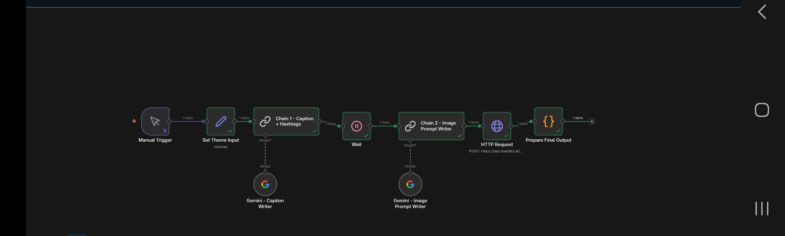
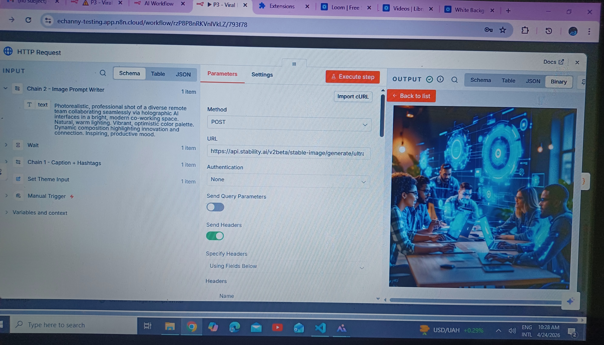
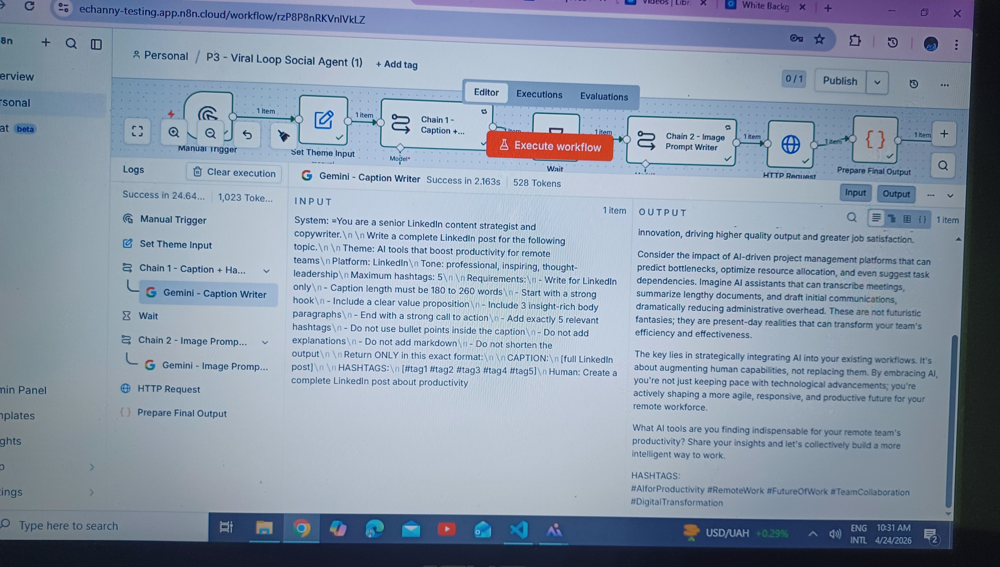

# Viral Loop Social Agent

Viral Loop Social Agent is an n8n workflow that turns a single content idea into a ready-to-publish social post. It uses Google Gemini for text and prompt generation, Stability AI for image creation, and a JavaScript code node to assemble the final output.

## What It Does

From one theme or campaign idea, the workflow produces:

- A platform-aware caption
- A set of relevant hashtags
- A generated image prompt
- An AI-generated visual asset
- A structured payload ready for publishing or downstream automation

## Workflow File

The repository includes the n8n workflow export:

- `P3 - Viral Loop Social Agent.json`

## Pipeline Overview

```text
Manual Trigger
  -> Set Theme Input
  -> Caption + Hashtags (Gemini)
  -> Image Prompt Generation (Gemini)
  -> Image Generation (Stability AI)
  -> Prepare Final Output
```

## How It Works

### 1. Input Configuration

The workflow starts with predefined inputs:

- `theme`: topic or campaign angle
- `platform`: target channel such as LinkedIn or Instagram
- `tone`: voice such as professional or inspiring
- `max_hashtags`: upper limit for hashtags

### 2. Caption Generation

Google Gemini generates:

- A strong opening hook
- Value-focused body copy
- A call to action
- Relevant hashtags

### 3. Image Prompt Generation

A second Gemini step converts the post into an image prompt optimized for:

- Composition
- Lighting
- Mood
- Square social format

### 4. Image Generation

The generated prompt is sent to Stability AI to produce:

- A social-ready image
- Square-format output
- Binary image data for further processing

### 5. Final Output Assembly

A JavaScript code node:

- Extracts the caption and hashtags 
- Builds the final post text
- Converts the image to base64
- Returns a structured JSON response

- # API Documentation

The Viral Loop Social Agent integrates external AI services through API communication to automate both text generation and visual content creation. Two primary APIs are used in this workflow: the Google Gemini API for caption generation and prompt engineering, and the Stability AI API for image generation. These services are orchestrated using n8n workflow automation.

---

## Google Gemini API
## Google Gemini API

### Purpose

Used for:
- LinkedIn caption generation
- Hashtag generation
- Image prompt engineering

### Model Used

`gemini-2.5-flash`

### Node Type

`@n8n/n8n-nodes-langchain.lmChatGoogleGemini`

### Configuration Details

| Parameter | Value |
|---|---|
| Model | gemini-2.5-flash |
| Temperature (Caption Writer) | 0.7 |
| Temperature (Image Prompt Writer) | 0.9 |
| Max Output Tokens | 1024 |

### Input Example

```json
{
  "theme": "AI tools that boost productivity for remote teams",
  "platform": "LinkedIn",
  "tone": "professional, inspiring, thought-leadership",
  "max_hashtags": 5
}

---

# Stability AI API 

## Overview

The Viral Loop Social Agent uses Stability AI to generate high-quality, photorealistic images that accompany the AI-generated LinkedIn post. After Google Gemini creates the caption and image prompt, the prompt is sent to Stability AI for image generation. The returned image is processed inside n8n and included in the final structured output.

---

## Purpose

Stability AI is used for:

- AI-powered image generation
- Professional social media visual creation
- LinkedIn and Instagram optimized square-format images
- Photorealistic content generation for marketing posts

---

## API Endpoint

```http
POST https://api.stability.ai/v2beta/stable-image/generate/ultra

### Endpoint

```http
POST https://api.stability.ai/v2beta/stable-image/generate/ultra

## Workflow Architecture



## Image Gallery




.jpg)



## Tech Stack

- n8n for workflow orchestration
- Google Gemini API for text generation
- Stability AI API for image generation
- JavaScript code node for data transformation
- HTTP Request nodes for API calls

## Setup

### Prerequisites

- An n8n instance
- A Google Gemini API key from Google AI Studio
- A Stability AI API key

### Import the Workflow

1. Open n8n.
2. Import `P3 - Viral Loop Social Agent.json`.
3. Review each node before running it in your environment.

### Configure Credentials

#### Google Gemini

1. Create or select your Gemini credentials in n8n.
2. Paste your API key from Google AI Studio.

#### Stability AI

Update the request header with your API key:

```text
Authorization
YOUR_STABILITY_API_KEY
```

## Troubleshooting

| Issue | Cause | Fix |
| --- | --- | --- |
| 429 Too Many Requests | Gemini rate limiting | Add a Wait node or reduce request frequency |
| 503 Service Unavailable | Temporary API load | Add retries with backoff |
| Invalid Authorization Header | Malformed API key or header | Re-check the header format and token |
| No Image Output | Stability AI request failed | Add fallback handling or inspect the API response |

## Use Cases

- Social media content automation
- Content marketing pipelines
- Personal branding workflows
- Agency-scale content production
- Growth experimentation and campaign iteration

## Benefits

- Reduces manual content creation time
- Keeps output structure consistent
- Scales well for repeatable campaign workflows
- Produces both copy and visuals in one run

## Roadmap

- Slack-based approval flow(human in the loop)
- Automatic posting to LinkedIn and Instagram
- Content performance tracking
- Multi-variant A/B generation
- Scheduling and publishing support

## Contributing

If you want to improve the workflow, open a pull request or adapt the exported n8n JSON to your environment and use case. Keep changes focused, document any new dependencies, and note any required credential changes.

